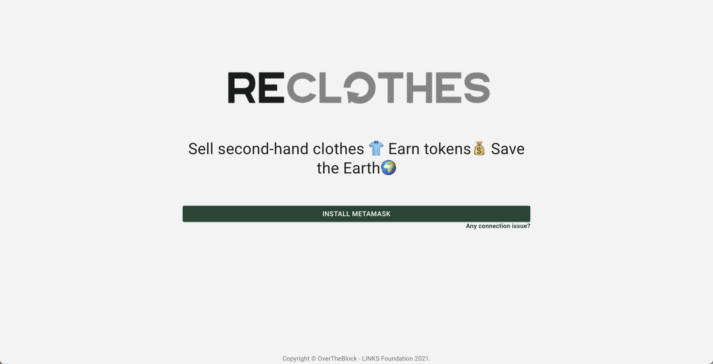
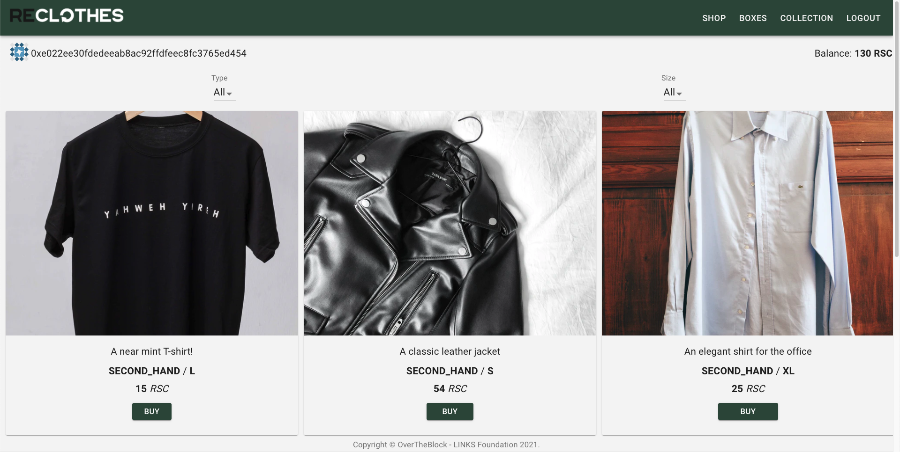
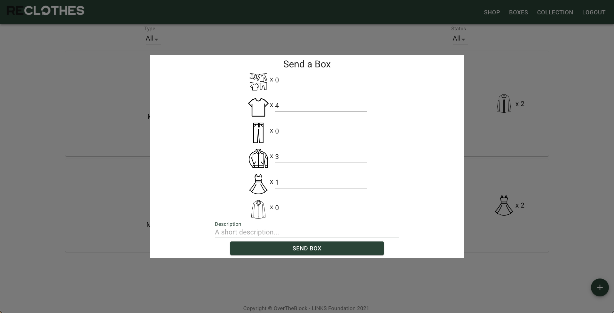
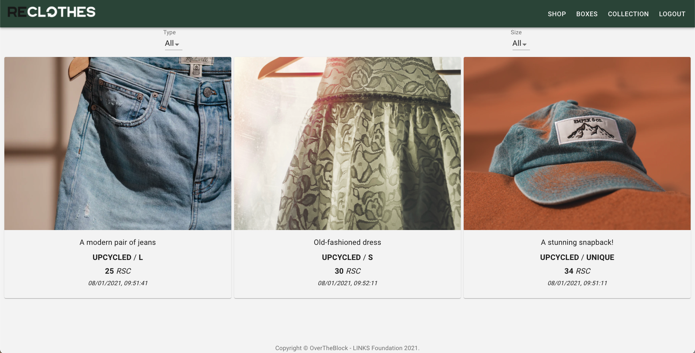

# ReClothes

**A decentralized solution for second-hand clothes recycle in the fashion industry.**

* Designed as an enterprise blockchain-based network on [Hyperledger Besu](https://besu.hyperledger.org/en/stable/).
* Allows **confidential** transactions visible only among business partners while keeping a transparent public history of quantities, processes, events, and payments.
* Encourages individuals' participation in the circular economy through a *double-incentive* using two [ERC20](https://docs.openzeppelin.com/contracts/erc20) token implementations, automating payments and rewarding mechanisms.
* Provides a *public* interface for people who wants to support the eco-friendly fashion industry by sending second-hand clothes and/or buying upcycled clothes.

You can learn more about the main challenges of the fashion sector and our solution's design to the article on our [OverTheBlock Medium](https://medium.com/overtheblock/reclothes-a-blockchain-based-solution-for-second-hand-clothes-market-ca2061080e3c) page.


## Table of Contents
- [Workflow](#workflow)
- [Frontend](#frontend)
- [Getting Started](#getting-started)
    - [Prerequisities](#prerequisities)
    - [Configuration](#configuration)
    - [Usage](#usage)
- [Screenshoots](#screenshoots)
- [Development Rules](#development-rules)
    - [Commit](#commit)
    - [Branch](#branch)
- [License](#license)

## Workflow

<div align="center">
    
    </div>
<p align="center"> <i>Figure 1.</i> A high-level representation of ReClothes solution workflow </p>

Figure 1 shows a high-level representation of the actors and the workflow of their features in ReClothes. The designed solution involves three different actors: 
* **ReClothes Dealer**: who represents a company operating in the fashion market, 
* **Recyclers**: who represents companies or entities which are involved in commercial relationships regarding clothes recycling activities and,
* **Customers**: who represents people interested in sending second-hand clothes and/or buying upcycled clothes.

The information regarding Customers and ReClothes Dealer interactions is *publicly* available and verifiable by anyone. Instead, the information between ReClothes Dealer and Recycler(s) is *confidential*. (i.e., visible and verifiable only by the participants who took part in the interaction). 

## Frontend
A simple and easy to use multi-page application in [ReactJS](https://reactjs.org/) designed for the ReClothes Customers. This is similar in many ways to a “traditional” dApp. It makes asynchronous calls to the blockchain node with a [Web3 provider](https://docs.metamask.io/guide/ethereum-provider.html), using [MetaMask](https://metamask.io/) for sending transactions. The application uses [Drizzle](https://www.trufflesuite.com/docs/drizzle/overview) for keeping the contract data, including state, events, and transactions in sync, taking advantage of the features of the [Redux store](https://redux.js.org/api/store/) on which Drizzle is based.

So, everyone having a MetaMask wallet can register as a Customer (note: the interface guides even the most inexperienced user towards the onboarding with MetaMask). The interface allows a Customer to view the shop where he/she can buy second-hand or upcycled clothes, register the shipping of second-hand clothes boxes and view its clothing collection.

## Getting Started

### Prerequisities
You need to have the following installed:

* [git](https://git-scm.com/downloads) >= *2.21.0*
* [node](https://nodejs.org/en/download/) >= *10.16.0*
* [npm](https://www.npmjs.com/get-npm) >= *6.14.4*

### Configuration
Clone the repository and install the packages:

```bash
git clone https://github.com/Innovation-Advisory-Links-Foundation/ReClothes-Frontend.git
cd ReClothes-Frontend
npm install
```

Clone the `ReClothes-Backend` repository and follow the `README.md` for bootstrap a local [Ganache](https://www.trufflesuite.com/ganache) development node or [Hyperledger Besu](https://besu.hyperledger.org/en/stable/) quickstart network.

```bash
git clone https://github.com/Innovation-Advisory-Links-Foundation/ReClothes-Backend.git
```

Make a copy of the `src/constants/environment.default.ts` and renamed it as `src/constants/environment.ts`. This file contains the necessary information for connecting to the blockchain network, both for local development (Ganache) or production-like (Hyperledger Besu) networks:

```TypeScript
export default {
    RECLOTHES_SHOP_ADDRESS_DEV: "YOUR-RECLOTHES-SHOP-DEV-ADDRESS-HERE",
    RECLOTHES_SHOP_ADDRESS_PROD: "YOUR-RECLOTHES-SHOP-PROD-ADDRESS-HERE",
    RESELLING_CREDIT_ADDRESS_DEV: "YOUR-RESELLING-CREDIT-DEV-ADDRESS-HERE",
    RESELLING_CREDIT_ADDRESS_PROD: "YOUR-RESELLING-CREDIT-PROD-ADDRESS-HERE",
    WEB3_PROVIDER: new Web3(Web3.givenProvider),
    PROD_NETWORK_TYPE: "besu",
    PROD_NETWORK_ID: 2018,
    DEV_NETWORK_TYPE: "private",
    PROD_NET_MODE: false
}
```

* The `RECLOTHES_SHOP_ADDRESS_DEV` and `RECLOTHES_SHOP_ADDRESS_PROD` values must contain, respectively, the addresses for Ganache (local) and Hyperledger Besu network development of your ReclothesShop smart contract deployed instance. 
* The `RESELLING_CREDIT_ADDRESS_DEV` and `RESELLING_CREDIT_ADDRESS_PROD` values must contain, respectively, the addresses for Ganache (local) and Hyperledger Besu network development of your ResellingCredit smart contract deployed instance.
* The `WEB3_PROVIDER` is the instance of Web3 library injected by MetaMask in your browser. 
* The `PROD_NETWORK_TYPE` and `PROD_NETWORK_ID` are the "production" network type/name (for Hyperledger Besu networks, the value is `besu`) and the correspondent chain id (for besu, the chain id is `2018`). 
* The `DEV_NETWORK_TYPE` indicates the network type/name for local development (for Ganache networks, the value is `private`).
* The `PROD_NET_MODE` is a boolean flag which must be set to `true` when using Hyperledger Besu, otherwise `false`.

(nb. The present `src/constants/environment.ts` file contains the addresses of the smart contracts released following the back-end README instructions. There should be no changes if no adjustments are made to the released default configurations.)

### Usage

To start the ReactJS application.

```bash
npm start
```

Run ESLint to check the syntax and style of your TypeScript code.

```bash
npm run lint
```

## Screenshoots

### MetaMask Onboarding

<div align="center">
    
    </div>
<p align="center"> <i>Figure 2.</i> Page for guiding the user to onboard with MetaMask </p>

### Shop Page for a User

<div align="center">
    
    </div>
<p align="center"> <i>Figure 3.</i> Shop page for a non-customer user </p>

### Shop Page for a Customer

<div align="center">
    
    </div>
<p align="center"> <i>Figure 4.</i> Shop page for a customer </p>

### Boxes Page for a Customer

<div align="center">
    
    </div>
<p align="center"> <i>Figure 5.</i> Boxes page for a customer </p>

### Send Box Form

<div align="center">
    
    </div>
<p align="center"> <i>Figure 6.</i> Form for sending a new box of second-hand clothes </p>

### Collection Page for a Customer

<div align="center">
    
    </div>
<p align="center"> <i>Figure 7.</i> Collection page for a customer </p>

##  Development Rules

### Commit

See how a minor change to your commit message style can make you a better programmer.

Format: `<type>(<scope>): <subject>`

`<scope>` is optional

#### Example

```
feat: add hat wobble
^--^  ^------------^
|     |
|     +-> Summary in present tense.
|
+-------> Type: chore, docs, feat, fix, refactor, style, or test.
```

More Examples:

- `feat`: (new feature for the user, not a new feature for build script)
- `fix`: (bug fix for the user, not a fix to a build script)
- `docs`: (changes to the documentation)
- `style`: (formatting, missing semicolons, etc.; no production code change)
- `refactor`: (refactoring production code, e.g., renaming a variable)
- `test`: (adding missing tests, refactoring tests; no production code change)
- `chore`: (updating grunt tasks etc.; no production code change)

**References**:

- [Conventional Commits](https://www.conventionalcommits.org/)
- [Semantic Commit Messages](https://seesparkbox.com/foundry/semantic_commit_messages)
- [Git Commit Msg](http://karma-runner.github.io/1.0/dev/git-commit-msg.html)

### Branch

* The *master* branch must be used for releases only.
* There is a dev branch, used to merge all sub dev branch.
* Avoid long descriptive names for long-lived branches.
* No CamelCase.
* Use grouping tokens (words) at the beginning of your branch names (in a similar way to the `type` of commit).
* Define and use small lead tokens to differentiate branches in a meaningful way to your workflow.
* Use slashes to separate parts of your branch names.
* Remove branch after merge if it is not essential.

Examples:
    
    git branch -b docs/README
    git branch -b test/one-function
    git branch -b feat/side-bar
    git branch -b style/header

## License
This repository is released under the [MIT](https://github.com/Innovation-Advisory-Links-Foundation/Ethereum-Backend-Boilerplate/blob/master/LICENSE) License.

---
Ethereum Frontend Boilerplate © 2020+, [LINKS Foundation](https://linksfoundation.com/)